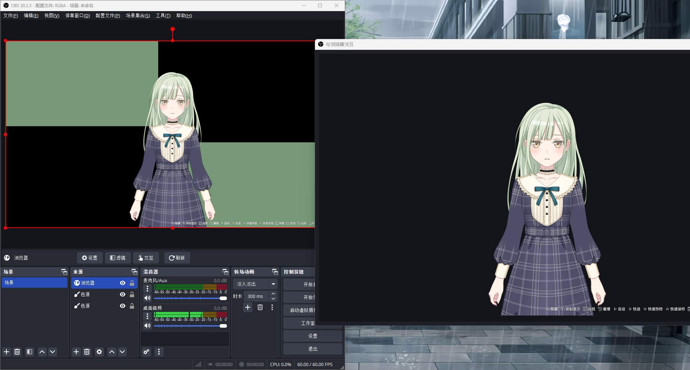

# WebGAL @ PartialEngine


这款二创引擎通过修改 CSS 文件，实现了画面的完全透明。这使你可以在无背景的情况下，直接使用 OBS Studio 捕获包含 Alpha 通道的 WebGAL 画面，无需再进行绿幕抠图等操作。

由于该引擎主要服务于 After Effects / Premiere Pro 的工作流，因此也可以称为“GoAE”。在决定使用前，请先评估它是否符合你的实际需求。

为了获得更清晰的录制效果，本引擎已将画布分辨率提升至 3840x2160 (4K)。如果你需要 2K 分辨率，可以下载源码进行手动修改。

**使用方法**

会在 Release 中提供 2K 和 4K 的打包版本。请注意，本引擎会覆盖游戏原有的或其他二创引擎的代码（素材不会），请确保你的游戏项目没有使用其他定制引擎。

*   **为现有游戏安装**：将文件解压并覆盖到 `\WebGal_Terre\public\games\<你的游戏>` 文件夹。
*   **为新游戏安装**：将文件解压到 `\WebGal_Terre\assets\templates\Derivative_Engine\<引擎名，如 partialengine-2k>` 文件夹，之后即可在创建新游戏时选择此引擎模板。

### **在 OBS Studio 中录制带透明通道的 WebGAL 画面**

#### **一、 添加浏览器源**

1.  在 WebGAL 编辑界面中，将鼠标悬停在左侧的画布上，右侧会显示三个操作按钮。
2.  点击 **`在新标签页中预览`** 按钮，浏览器会打开一个新的标签页。
3.  复制这个新标签页的 URL。
4.  在 OBS Studio 中添加一个“浏览器”源，将刚才复制的 URL 粘贴进去。
5.  在该浏览器源的属性中，找到 **`自定义 CSS`** 选项，并填入以下代码以实现背景透明：
    ```css
    { background-color: transparent; }
    ```

#### **二、 设置 OBS Studio 以录制 Alpha 通道**

为了录制包含透明信息（Alpha 通道）的视频，你需要调整 OBS 的输出设置。建议为此创建一个新的配置文件（例如，命名为 `RGBA`）以便管理。

**方法一：使用 MOV 格式**

1.  打开 OBS “设置”，进入 **`输出`** 选项卡。
2.  将“输出模式”设置为“简单”。
3.  在“录像”部分，将 **`录像格式`** 修改为 `mov`。
4.  返回主界面，在 **`高级`** 设置中，找到“色彩格式”并修改为 `BGRA`。

通过以上设置录制的 `.mov` 文件将包含 Alpha 通道。

**方法二：使用 WebM 格式**

1.  打开 OBS “设置”，进入 **`输出`** 选项卡。
2.  将“输出模式”设置为 **`高级`**。
3.  在“录像”选项卡中，将“类型”选择为 **`自定义输出 (FFmpeg)`**。
4.  将 **`容器格式`** 选择为 `webm`。
5.  同样，确保在 **`高级`** 设置中，色彩格式为 `BGRA`。

此方法录制的 `.webm` 文件也会包含 Alpha 通道，通常文件体积会更小。

关于更多的方式，可以自行搜索相关视频网站。

## 接下来是原仓库的 README


### **[English Version](/README_EN.md)** | **[日本語版](/README_JP.md)** | **[한국어](/README_KO.md)** | **[Français](/README_FR.md)**

**[Help us with translation | 协助翻译 | 翻訳のお手伝い | 번역을 도와주세요](https://github.com/OpenWebGAL/WebGAL/tree/dev/packages/webgal/src/translations)**

**[Join Discord Server | 加入 Discord 讨论 | Discordのディスカッションに参加する](https://discord.gg/kPrQkJttJy)**

<a href="https://www.producthunt.com/posts/webgal?utm_source=badge-featured&utm_medium=badge&utm_souce=badge-webgal" target="_blank"></a>

# WebGAL

**界面美观、功能强大、易于开发的全新网页端视觉小说引擎**

# WebGAL 提供可视化编辑器

**创作视觉小说，何须会编程？欢迎体验 [WebGAL 图形化编辑器](https://github.com/OpenWebGAL/WebGAL_Terre/)**

## 在线体验

#### WebGAL 示例游戏，一般会演示最新开发的功能

https://demo.openwebgal.com

#### 完整的游戏

[铃色☆记忆](http://hoshinasuzu.cn/) by 星奈组  [备用链接](http://hoshinasuzu.cc/)

[Elf of Era Idols Project](https://store.steampowered.com/app/2414730/Elf_of_Era_Idols_Project/) (通过 Steam 获取)

## 使用 WebGAL 制作游戏

[WebGAL 开发文档](https://docs.openwebgal.com/)

[下载 WebGAL 图形化编辑器](https://github.com/OpenWebGAL/WebGAL_Terre/releases)

你也可以使用源代码或 [WebGAL 调试工具](https://github.com/OpenWebGAL/WebGAL/releases) 制作游戏，并使用 [WebGAL Script VS Code 插件](https://marketplace.visualstudio.com/items?itemName=c6h5-no2.webgal-script-basics) 来启用语法高亮

## WebGAL 优势与特色

一次编写，处处运行，无需网页开发基础，3 分钟即可学会所有的语法，只要你有灵感，就可以立刻开始开始创作你自己的视觉小说！

### 界面美观

美观优雅的图形用户界面与交互效果，一切都是为了更好的用户体验。

### 功能强大

不仅支持主流视觉小说引擎所具有的几乎全部功能，你还可以使用 Pixi.js 为你的游戏添加自定义效果。

### 易于开发

无论是使用 WebGAL 脚本还是使用可视化编辑器进行开发，一切都是那么简单自然。

### 参与 WebGAL 的开发工作

**想要参与引擎开发的开发者请阅读 [此项目的参与指南](https://docs.openwebgal.com/developers/)**

### 赞助

WebGAL 是一款开源软件，因此你可以免费在 MPL-2.0 开源协议的范畴下使用本软件，并可用于商业使用。

但即便如此，你的赞助也可以给予开发者前进的动力，让这个项目变得更好。

[赞助本项目](https://docs.openwebgal.com/sponsor/)

# Sponsors

<a href="https://openwebgal.com/">

</a>

## Stargazers over time

[](https://starchart.cc/OpenWebGAL/WebGAL)
